# 📘 University Course Management System – PL/SQL Capstone Project

## 👤 Student Info
- **Name:** Praise Mutijima
- **Student ID:** 25954
- **Course:** Database Development with PL/SQL (INSY 8311)
- **Lecturer:** Eric Maniraguha

---

## ✅ Phase I – Problem Statement & Presentation

### 📌 Problem Definition
Universities face challenges in managing course registrations, schedules, and grading. Manual operations lead to errors, inefficiencies, and limited access to academic records.

### 🏫 Context
This system will be used within a university to automate course registration, schedule assignment, and grade entry.

### 👥 Target Users
- Students
- Professors
- Administrators

### 🎯 Project Goals
- Automate registration and grade submission
- Prevent schedule conflicts
- Provide secure access to student records

### 📂 Main Entities
- Students
- Professors
- Courses
- Schedules
- Enrollments

### 📽️ Presentation
   [Click here to download the PowerPoint](./Wed_25954_praise_plsql.pptx)

---

## ✅ Phase II – Business Process Modeling (MIS)

### 📘 Overview
This phase models the flow of course registration, grade submission, and scheduling from the perspective of key actors: students, professors, administrators, and the system (MIS). It shows how the MIS supports and enhances decision-making and operational efficiency.

### 🧑‍🏫 Actors / Swimlanes
- **Student**: Registers for courses and views grades
- **Professor**: Manages course assignments and enters student grades
- **Administrator**: Schedules courses and assigns professors
- **System (MIS)**: Validates and stores all inputs, detects conflicts, and secures access

### 🧭 Process Modeled
1. Administrator creates the course schedule and assigns professors.
2. Student browses available courses and registers.
3. The system checks for conflicts and stores the enrollment.
4. At the end of the term, the professor submits grades.
5. The student views their grades through the system.

### 📊 Swimlane Diagram
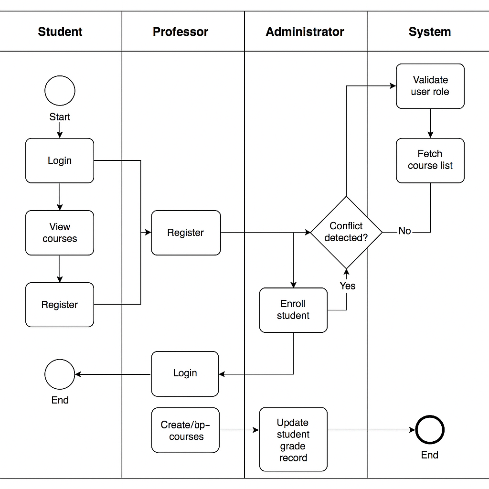

### Model the Process
Steps to include in your diagram:
- Admin logs in and creates course schedule.
- Instructor is assigned to course.
- Student browses available courses.
- Student registers for selected courses.
- Instructor enters grades after course completion.
- Student views grades.
- MIS stores and updates data.

### Explanation of Business Process Model – University Course Management System

The modeled process demonstrates how students, professors, and administrators interact with a centralized MIS to manage academic operations. Students log in, view available courses, and register. The system checks for schedule conflicts before enrollment. Professors access assigned courses and submit student grades after course completion. The administrator manages course offerings and schedules, ensuring every course has an assigned professor and an available time slot.

The system enforces data integrity and access control. Students can only view their records, professors update only their assigned course grades, and admins handle course logistics. The MIS automates conflict detection and reduces errors, supporting fast, reliable decision-making.

This workflow increases efficiency, reduces administrative workload, and ensures accurate academic records. It directly supports MIS goals by streamlining operations, centralizing data, and improving data-driven decision-making.

  
### 🔍 Features of the Process Model
- Prevents scheduling conflicts using MIS logic
- Applies access control per user role (student/professor/admin)
- Centralizes grade storage and transcript access
- Encourages automation and traceability in the academic process

### 🧠 MIS Decision Support
- MIS checks time slots for overlap
- Records all actions for accountability
- Automatically restricts unauthorized actions (e.g., grade editing by students)


---

## ✅ Phase III – Logical Model Design - University Management System

### 📘 Overview
This phase defines the logical data model for the University Management System using the core primary entities based on the finalized ER diagram, which manages students, professors, courses, enrollments, and schedules.

### 🧱 Entity-Relationship (ER) Diagram
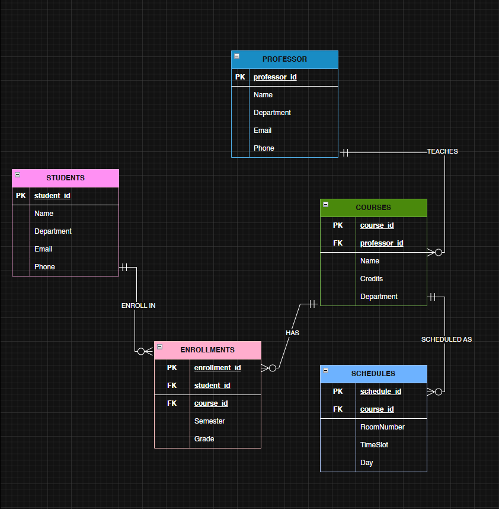

### 📂 Core Entities

#### Primary Entities
- **Students**: Contains student ID, name, department, email, and phone.
- **Professors**: Contains professor ID, name, department, email, and phone.
- **Courses**: Stores course ID, name, credits, department, and assigned professor ID.
- **Enrollments**: Join table to link students and courses, with enrollment ID, semester, and grade.
- **Schedules**: Associates a course with room, day, and timeslot.

### 🔗 Relationships (as per ER diagram)
- **Students → Enrollments**: One-to-Many (a student can enroll in many courses)
- **Courses → Enrollments**: One-to-Many (a course can have many enrolled students)
- **Professors → Courses**: One-to-Many (a professor can teach multiple courses)
- **Courses → Schedules**: One-to-One or One-to-Many (each course has a scheduled session)

### 🔐 Data Integrity Features
- **NOT NULL** constraints on all primary keys and essential fields
- **UNIQUE** constraints on identifiers such as email and course codes
- **CHECK** constraints (e.g., grade values, course credits, time slot formats)
- **Foreign Keys** to enforce referential integrity between students, courses, professors, and schedules

### 🔁 Normalization
The model is normalized to **3NF**:
- No repeating groups or partial dependencies
- All non-key attributes depend only on the primary key
- `Schedules` retains simplified structure (Room, TimeSlot, Day directly included)

### 💡 Key Design Decisions
1. **Simplified scheduling model**: room/time/day stored within Schedules without separating to avoid over-normalization.
2. **Join table Enrollments** handles many-to-many relationships between Students and Courses.
3. **Single professor assignment** per course ensures clear instructional responsibility.

---

## ✅ Phase IV – Database Creation and Naming

### 📛 Database Name
- **Database:** WED_25954_PRAISE_UNIVERSITY_DB
- **Password:** Praise
  
  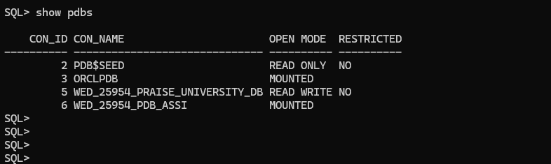

### 🔑 Privileges
- Granted **DBA** role to user

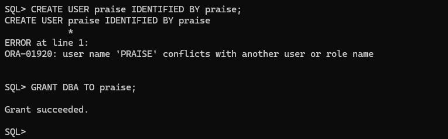

### 🖥️ OEM Access
- OEM accessed at `https://localhost:5500/`
- SSL bypass used to open OEM successfully

### 📸 Screenshots
- OEM login page – **SPACE FOR SCREENSHOT**
- Database dashboard – **SPACE FOR SCREENSHOT**
- Schema and tables visible – **SPACE FOR SCREENSHOT**
- Users and roles – **SPACE FOR SCREENSHOT**
- Performance metrics (optional) – **SPACE FOR SCREENSHOT**

---

## ✅ Phase V – Table Implementation and Data Insertion

### 🧱 Table Implementation
Below are the SQL scripts used to create the core tables for the University Course Management System:

```sql
-- Create Students table
CREATE TABLE Students (
    Student_ID INT PRIMARY KEY,
    Name VARCHAR(100) NOT NULL,
    Department VARCHAR(50) NOT NULL,
    Email VARCHAR(100) NOT NULL UNIQUE,
    Phone VARCHAR(20) NOT NULL,
    CONSTRAINT valid_student_email CHECK (Email LIKE '%_@_%._%')
);

-- Create Professors table
CREATE TABLE Professors (
    Professor_ID INT PRIMARY KEY,
    Name VARCHAR(100) NOT NULL,
    Department VARCHAR(50) NOT NULL,
    Email VARCHAR(100) NOT NULL UNIQUE,
    Phone VARCHAR(20) NOT NULL,
    CONSTRAINT valid_professor_email CHECK (Email LIKE '%_@_%._%')
);

-- Create Courses table
CREATE TABLE Courses (
    Course_ID INT PRIMARY KEY,
    Professor_ID INT NOT NULL,
    Name VARCHAR(100) NOT NULL,
    Credits INT NOT NULL,
    Department VARCHAR(50) NOT NULL,
    CONSTRAINT valid_credits CHECK (Credits BETWEEN 1 AND 6),
    FOREIGN KEY (Professor_ID) REFERENCES Professors(Professor_ID)
);

-- Create Enrollments table
CREATE TABLE Enrollments (
    Enrollment_ID INT PRIMARY KEY,
    Student_ID INT NOT NULL,
    Course_ID INT NOT NULL,
    Semester VARCHAR(20) NOT NULL,
    Grade VARCHAR(2) DEFAULT NULL,
    CONSTRAINT valid_grade CHECK (Grade IN ('A+', 'A', 'A-', 'B+', 'B', 'B-', 'C+', 'C', 'C-', 'D+', 'D', 'F', NULL)),
    CONSTRAINT unique_enrollment UNIQUE (Student_ID, Course_ID, Semester),
    FOREIGN KEY (Student_ID) REFERENCES Students(Student_ID),
    FOREIGN KEY (Course_ID) REFERENCES Courses(Course_ID)
);

-- Create Schedules table
CREATE TABLE Schedules (
    Schedule_ID INT PRIMARY KEY,
    Course_ID INT NOT NULL,
    Room_Number VARCHAR(20) NOT NULL,
    Time_Slot VARCHAR(30) NOT NULL,
    Day VARCHAR(10) NOT NULL,
    CONSTRAINT valid_day CHECK (Day IN ('Monday', 'Tuesday', 'Wednesday', 'Thursday', 'Friday', 'Saturday', 'Sunday')),
    CONSTRAINT unique_room_time_day UNIQUE (Room_Number, Time_Slot, Day),
    FOREIGN KEY (Course_ID) REFERENCES Courses(Course_ID)
);
```

### 📥 Sample Data Inserted
```sql
--INSERTING INTO STUDENTS TABLE
INSERT INTO Students (Student_ID, Name, Department, Email, Phone) VALUES
(1, 'Alice Johnson', 'Computer Science', 'alice.johnson@example.edu', '123-456-7890');
INSERT INTO Students (Student_ID, Name, Department, Email, Phone) VALUES
(2, 'Bob Smith', 'Information Systems', 'bob.smith@example.edu', '234-567-8901');
INSERT INTO Students (Student_ID, Name, Department, Email, Phone) VALUES
(3, 'Catherine Lee', 'Computer Science', 'catherine.lee@example.edu', '345-678-9012');

--INSERTING INTO PROFESSORS TABLE
INSERT INTO Professors (Professor_ID, Name, Department, Email, Phone) VALUES
(101, 'Dr. Emily Davis', 'Computer Science', 'emily.davis@university.edu', '456-789-0123');
INSERT INTO Professors (Professor_ID, Name, Department, Email, Phone) VALUES
(102, 'Dr. John Miller', 'Information Systems', 'john.miller@university.edu', '567-890-1234');

--INSERTING INTO COURSES TABLE
INSERT INTO Courses (Course_ID, Professor_ID, Name, Credits, Department) VALUES
(1001, 101, 'Database Systems', 3, 'Computer Science');
INSERT INTO Courses (Course_ID, Professor_ID, Name, Credits, Department) VALUES
(1002, 101, 'Data Structures', 4, 'Computer Science');
INSERT INTO Courses (Course_ID, Professor_ID, Name, Credits, Department) VALUES
(1003, 102, 'E-commerce Systems', 3, 'Information Systems');

--INSERTING INTO ENROLLMENTS TABLE
INSERT INTO Enrollments (Enrollment_ID, Student_ID, Course_ID, Semester, Grade) VALUES
(1, 1, 1001, 'Fall 2024', 'A');
INSERT INTO Enrollments (Enrollment_ID, Student_ID, Course_ID, Semester, Grade) VALUES
(2, 1, 1002, 'Fall 2024', 'B+');
INSERT INTO Enrollments (Enrollment_ID, Student_ID, Course_ID, Semester, Grade) VALUES
(3, 2, 1003, 'Fall 2024', 'A-');
INSERT INTO Enrollments (Enrollment_ID, Student_ID, Course_ID, Semester, Grade) VALUES
(4, 3, 1001, 'Fall 2024', 'B');
INSERT INTO Enrollments (Enrollment_ID, Student_ID, Course_ID, Semester, Grade) VALUES
(5, 3, 1003, 'Fall 2024', 'A');

--INSERTING INTO SCHEDULES TABLE
INSERT INTO Schedules (Schedule_ID, Course_ID, Room_Number, Time_Slot, Day) VALUES
(201, 1001, 'Room A101', '08:00-09:30', 'Monday');
INSERT INTO Schedules (Schedule_ID, Course_ID, Room_Number, Time_Slot, Day) VALUES
(202, 1002, 'Room A102', '10:00-11:30', 'Wednesday');
INSERT INTO Schedules (Schedule_ID, Course_ID, Room_Number, Time_Slot, Day) VALUES
(203, 1003, 'Room B201', '13:00-14:30', 'Tuesday');
```

- Realistic records inserted into each table (3–5 entries per table)
- Test data supports queries and use cases

### 🔍 Data Integrity Verification
- Checked referential integrity and constraint enforcement
- Executed SELECT queries to verify insertions

### 📸 Screenshots

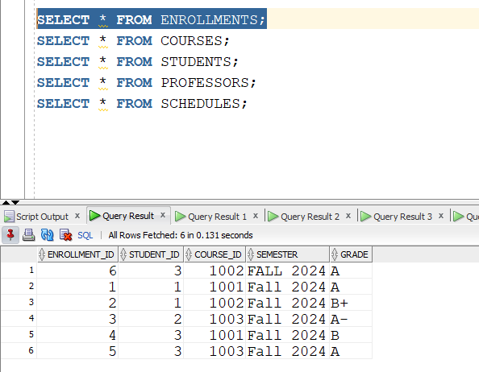

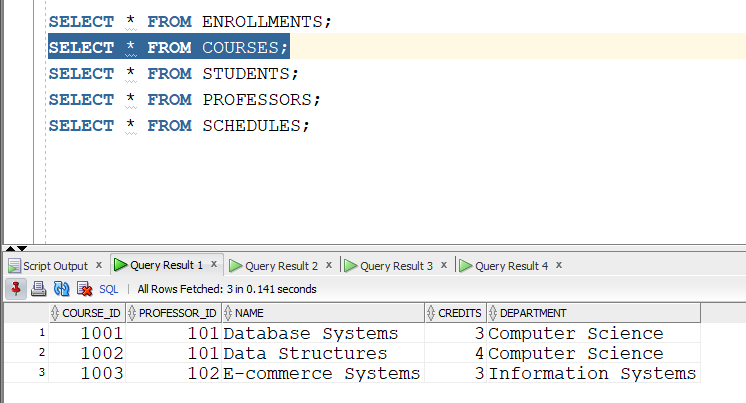

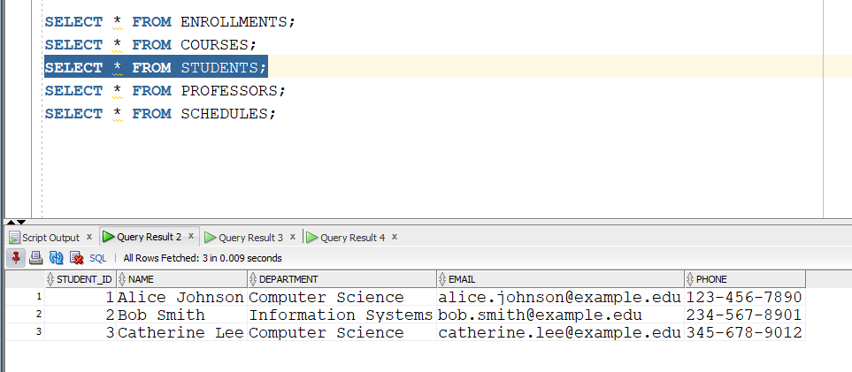

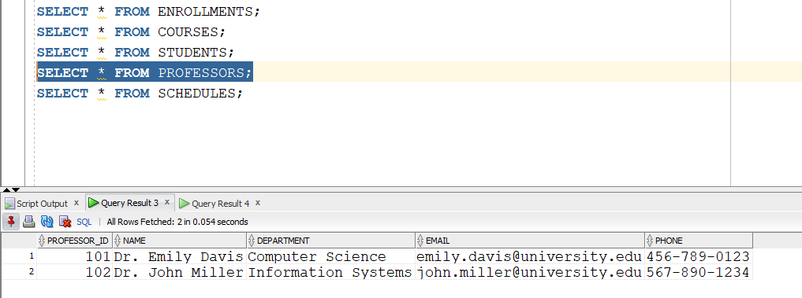

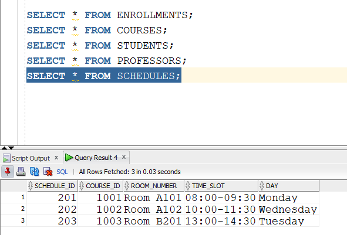

---

## ✅ Phase VI – Database Interaction and Transactions

### 🔄 Operations Performed
Implemented DDL and DML operations for managing students, courses, enrollments, schedules, and professors.

- **DML**: `INSERT`, `UPDATE`, `DELETE` for Students, Courses, Enrollments
- **DDL**: Created PL/SQL procedures, functions, cursors, and packages

### 🧩 Procedures & Functions

#### ➤ Procedure: Register Student
```sql
CREATE OR REPLACE PROCEDURE proc_register_student (
    p_enrollment_id IN NUMBER,
    p_student_id IN NUMBER,
    p_course_id IN NUMBER,
    p_semester IN VARCHAR2,
    p_grade IN VARCHAR2
) AS
BEGIN
    INSERT INTO enrollments (enrollment_id, student_id, course_id, semester, grade)
    VALUES (p_enrollment_id, p_student_id, p_course_id, p_semester, p_grade);
EXCEPTION
    WHEN DUP_VAL_ON_INDEX THEN
        DBMS_OUTPUT.PUT_LINE('Student is already enrolled in this course.');
END;
```

#### ➤ Function: Get Student GPA
```sql
CREATE OR REPLACE FUNCTION fn_get_student_gpa (
    p_student_id IN NUMBER
) RETURN NUMBER IS
    v_gpa NUMBER;
BEGIN
    SELECT AVG(
        CASE grade
            WHEN 'A' THEN 4.0
            WHEN 'A-' THEN 3.7
            WHEN 'B+' THEN 3.5
            WHEN 'B' THEN 3.0
            WHEN 'B-' THEN 2.7
            WHEN 'C+' THEN 2.5
            WHEN 'C' THEN 2.0
            WHEN 'D' THEN 1.0
            WHEN 'F' THEN 0.0
            ELSE NULL
        END
    )
    INTO v_gpa
    FROM enrollments
    WHERE student_id = p_student_id;

    RETURN v_gpa;
EXCEPTION
    WHEN NO_DATA_FOUND THEN
        RETURN NULL;
END;
```

### 🔁 Cursor Example
```sql
DECLARE
    CURSOR c_enrollments IS
        SELECT course_id, semester, grade
        FROM enrollments
        WHERE student_id = 3;

    v_course_id  enrollments.course_id%TYPE;
    v_semester   enrollments.semester%TYPE;
    v_grade      enrollments.grade%TYPE;
BEGIN
    OPEN c_enrollments;
    LOOP
        FETCH c_enrollments INTO v_course_id, v_semester, v_grade;
        EXIT WHEN c_enrollments%NOTFOUND;
        DBMS_OUTPUT.PUT_LINE('Course ID: ' || v_course_id || ', Semester: ' || v_semester || ', Grade: ' || v_grade);
    END LOOP;
    CLOSE c_enrollments;
END;
/
```

### 📦 Package Definition and Body
```sql
CREATE OR REPLACE PACKAGE student_pkg AS
    PROCEDURE proc_register_student (
        p_enrollment_id IN NUMBER,
        p_student_id IN NUMBER,
        p_course_id IN NUMBER,
        p_semester IN VARCHAR2,
        p_grade IN VARCHAR2
    );
    FUNCTION fn_get_student_gpa (
        p_student_id IN NUMBER
    ) RETURN NUMBER;
END student_pkg;
/

CREATE OR REPLACE PACKAGE BODY student_pkg AS

    PROCEDURE proc_register_student (
        p_enrollment_id IN NUMBER,
        p_student_id IN NUMBER,
        p_course_id IN NUMBER,
        p_semester IN VARCHAR2,
        p_grade IN VARCHAR2
    ) IS
    BEGIN
        INSERT INTO enrollments (enrollment_id, student_id, course_id, semester, grade)
        VALUES (p_enrollment_id, p_student_id, p_course_id, p_semester, p_grade);
    EXCEPTION
        WHEN DUP_VAL_ON_INDEX THEN
            DBMS_OUTPUT.PUT_LINE('Student is already enrolled in this course.');
    END;

    FUNCTION fn_get_student_gpa (
        p_student_id IN NUMBER
    ) RETURN NUMBER IS
        v_gpa NUMBER;
    BEGIN
        SELECT AVG(
            CASE grade
                WHEN 'A' THEN 4.0
                WHEN 'A-' THEN 3.7
                WHEN 'B+' THEN 3.5
                WHEN 'B' THEN 3.0
                WHEN 'B-' THEN 2.7
                WHEN 'C+' THEN 2.5
                WHEN 'C' THEN 2.0
                WHEN 'D' THEN 1.0
                WHEN 'F' THEN 0.0
                ELSE NULL
            END
        )
        INTO v_gpa
        FROM enrollments
        WHERE student_id = p_student_id;

        RETURN v_gpa;
    EXCEPTION
        WHEN NO_DATA_FOUND THEN
            RETURN NULL;
    END;

END student_pkg;
/
```

### 🧪 Testing Summary
- Procedures and functions tested using anonymous PL/SQL blocks and `DBMS_OUTPUT`
- Cursor loops verified for student course listings
- Function tested for GPA calculation

### 📸 Screenshots
- Procedure creation and compilation –
  
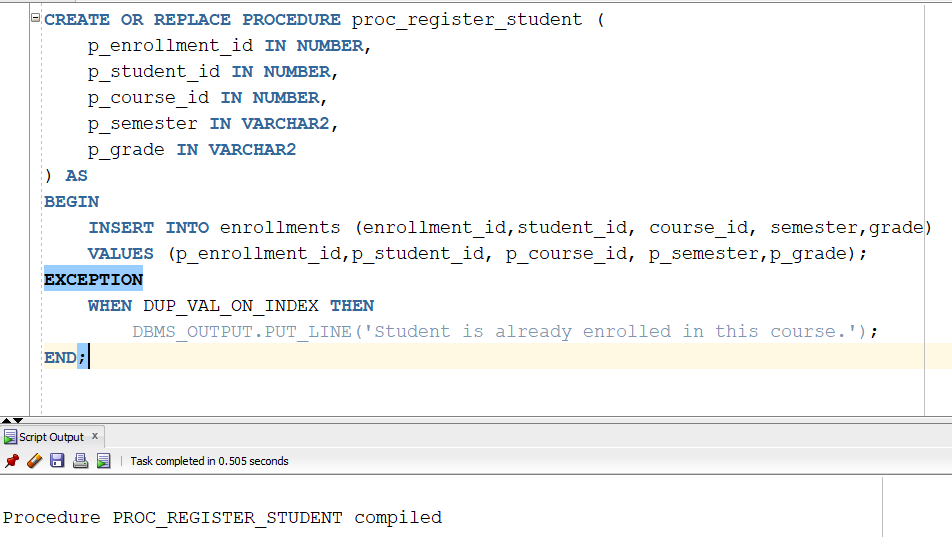

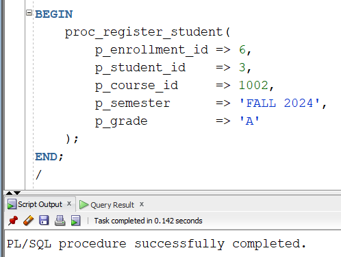

- Function implementation and output –
  
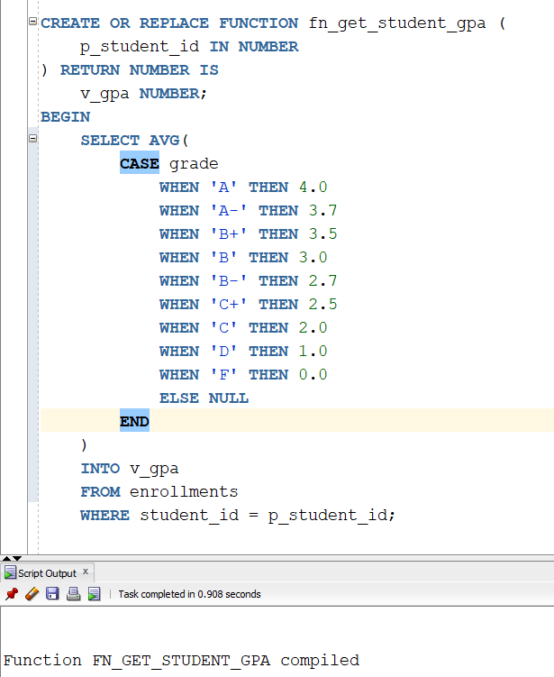

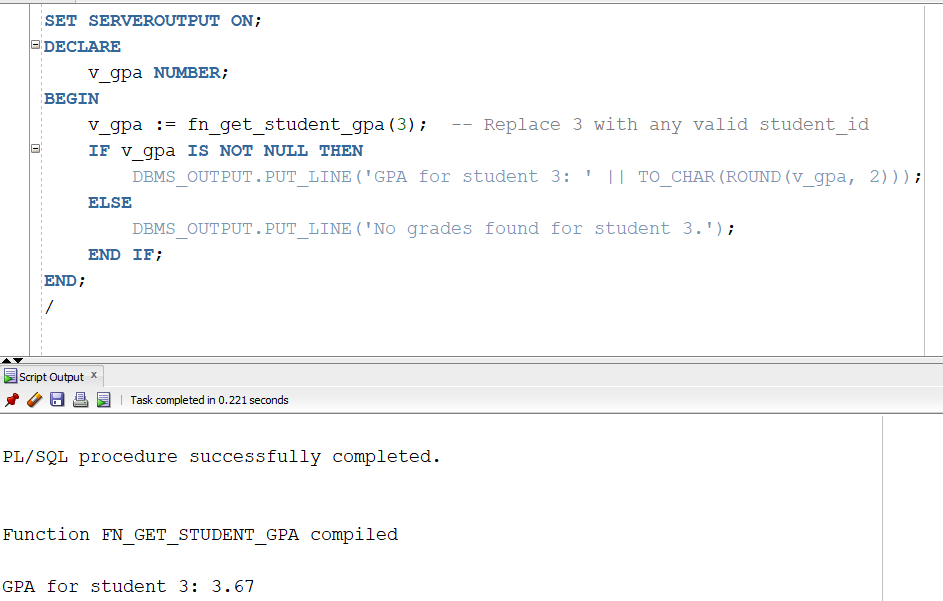

- Cursor loop output in `DBMS_OUTPUT` –

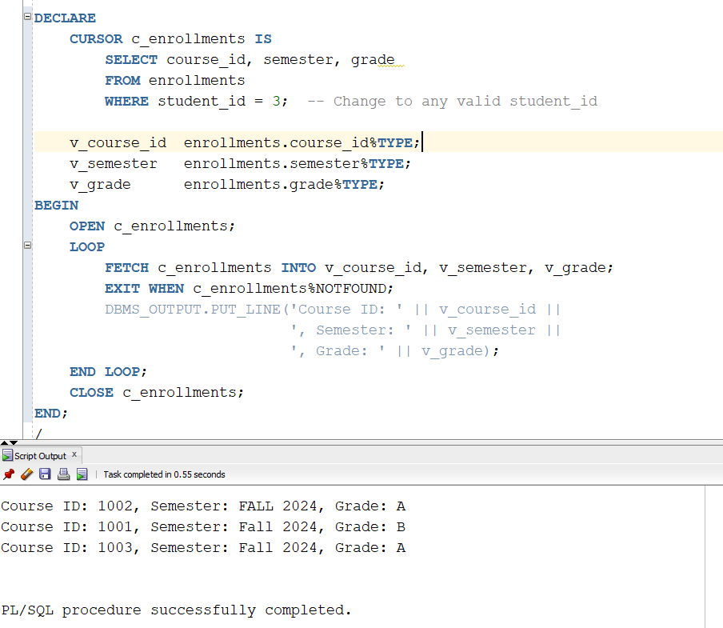
  
- Package body and execution –

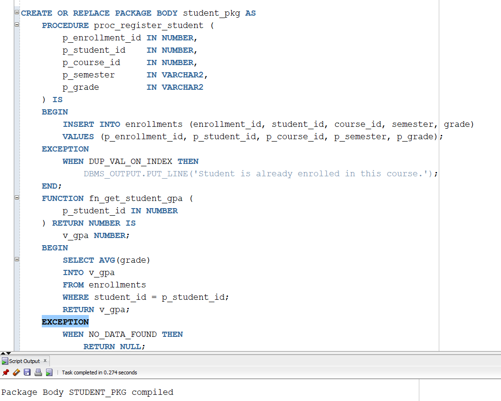


---
## ✅ Phase VII – Advanced Database Programming and Auditing

### 🔒 Access Restrictions
Created mechanisms to prevent unauthorized DML (INSERT, UPDATE, DELETE) operations during weekdays and public holidays, and to monitor user actions.

### 📅 Holiday_Dates Table
```sql
CREATE TABLE Holiday_Dates (
    holiday_date DATE PRIMARY KEY,
    description VARCHAR2(100)
);
```
Stores official public holidays. Used to restrict changes on those days.

### 📋 Audit_Log Table
```sql
CREATE TABLE Audit_Log (
    log_id NUMBER GENERATED ALWAYS AS IDENTITY PRIMARY KEY,
    user_id VARCHAR2(100),
    action_type VARCHAR2(10),
    table_name VARCHAR2(30),
    action_time TIMESTAMP DEFAULT SYSTIMESTAMP,
    status VARCHAR2(20)
);
```
Captures user actions on the `Enrollments` table including action type, timestamp, and status.

### ⚠️ Trigger: Block Changes on Weekdays or Holidays
```sql
CREATE OR REPLACE TRIGGER trg_block_changes
BEFORE INSERT OR UPDATE OR DELETE ON Enrollments
FOR EACH ROW
DECLARE
    v_day VARCHAR2(10);
    v_today DATE := TRUNC(SYSDATE);
    v_is_holiday NUMBER;
BEGIN
    v_day := TO_CHAR(v_today, 'DY', 'NLS_DATE_LANGUAGE = ENGLISH');
    SELECT COUNT(*) INTO v_is_holiday FROM Holiday_Dates WHERE holiday_date = v_today;

    IF v_day IN ('MON','TUE','WED','THU','FRI') OR v_is_holiday > 0 THEN
        RAISE_APPLICATION_ERROR(-20001, 'Changes are not allowed during weekdays or public holidays.');
    END IF;
END;
/
```

### 🛡️ Trigger: Auditing Enrollments
```sql
CREATE OR REPLACE TRIGGER trg_audit_enrollments
AFTER INSERT OR UPDATE OR DELETE ON Enrollments
FOR EACH ROW
DECLARE
    v_action VARCHAR2(10);
BEGIN
    IF INSERTING THEN v_action := 'INSERT';
    ELSIF UPDATING THEN v_action := 'UPDATE';
    ELSIF DELETING THEN v_action := 'DELETE';
    END IF;

    INSERT INTO Audit_Log (user_id, action_type, table_name, status)
    VALUES (USER, v_action, 'Enrollments', 'ALLOWED');
END;
/
```

### 🧪 Testing
- Inserted holidays into `Holiday_Dates`
- Attempted DML actions on weekdays/holidays (triggered restriction)
- Successfully ran DML actions on weekend
- Verified actions logged in `Audit_Log`

### 📸 Screenshots
- `Holiday_Dates` and `Audit_Log` table creation

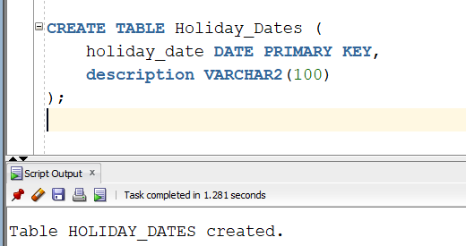

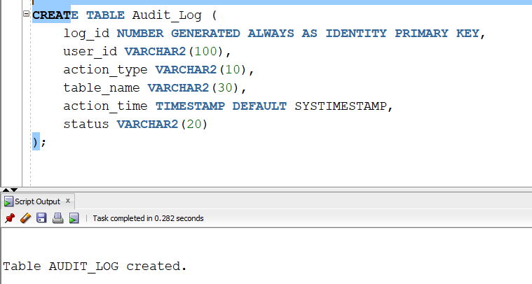
- `trg_block_changes` creation –
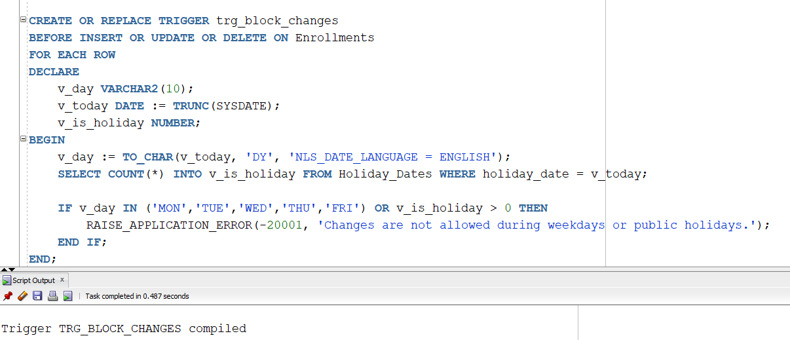

- `trg_audit_enrollments` creation –
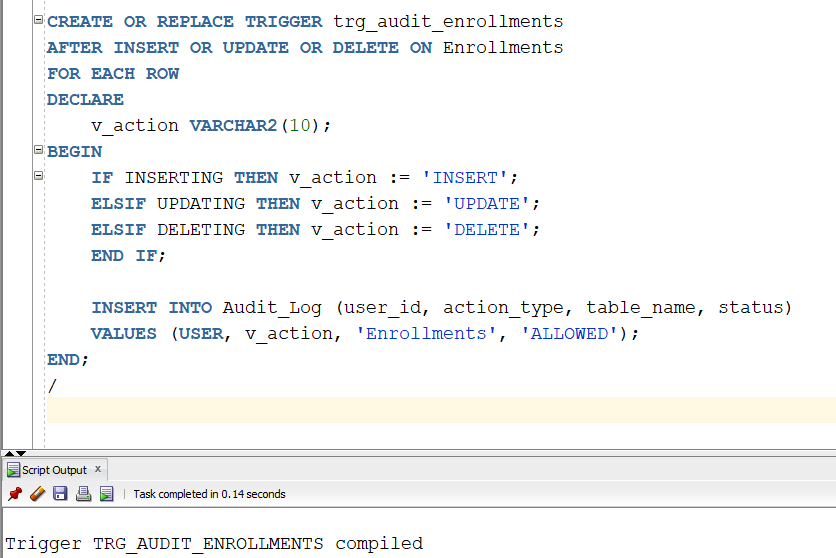

- Error shown on restricted day 
```sql
-- Try inserting on a restricted weekday or holiday
declare
begin
    INSERT INTO Enrollments (Enrollment_ID, Student_ID, Course_ID, Semester, Grade)
    VALUES (6, 3, 1002, 'Spring 2025', 'A');
end;
/
-- Expected Error:
-- ORA-20001: Changes are not allowed during weekdays or public holidays.
```

- Log entry after successful change
```sql
-- Insert on a weekend to pass the restriction
INSERT INTO Enrollments (Enrollment_ID, Student_ID, Course_ID, Semester, Grade)
VALUES (7, 2, 1001, 'Spring 2025', 'B');
-- This should be allowed and trigger an audit log insert
```

- Query output from `Audit_Log` 
```sql
SELECT * FROM Audit_Log ORDER BY action_time DESC;
```
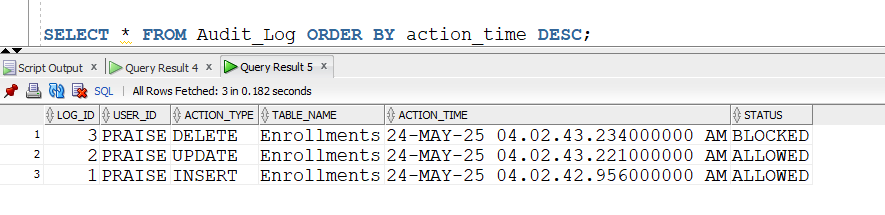

---

## 🔜 Next: Phase VIII – Documentation and Presentation

[Click here to download the PowerPoint](./pptx/University-Course-Management-System.pptx)

---

## 🧾 Conclusion

The University Course Management System project successfully demonstrated the practical application of PL/SQL for managing student records, course scheduling, enrollment, and grade processing. Throughout the phases, we implemented robust database structures, enforced data integrity through constraints and triggers, and automated workflows with procedures, functions, and packages. The integration of business process modeling and auditing further strengthened the system's reliability and security.

This project enhanced my skills in database development, data modeling, PL/SQL programming, and MIS principles. It also reinforced the importance of systematic testing, clear documentation, and effective design when building scalable and maintainable systems.
