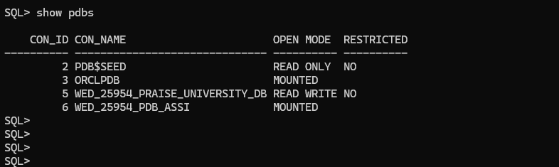
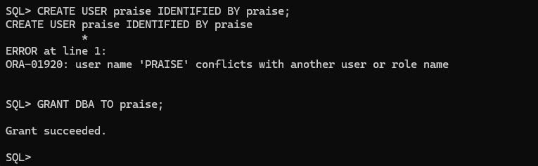
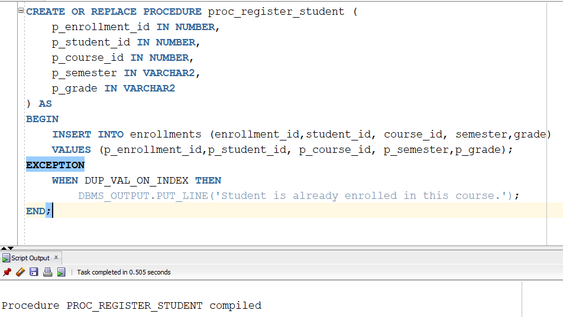
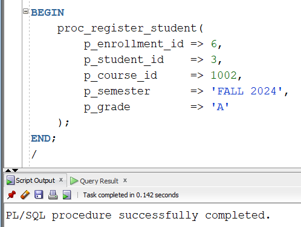
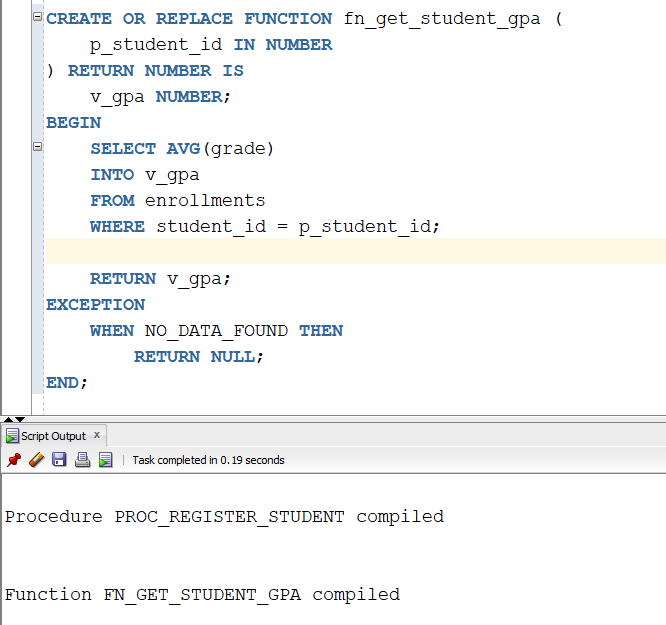
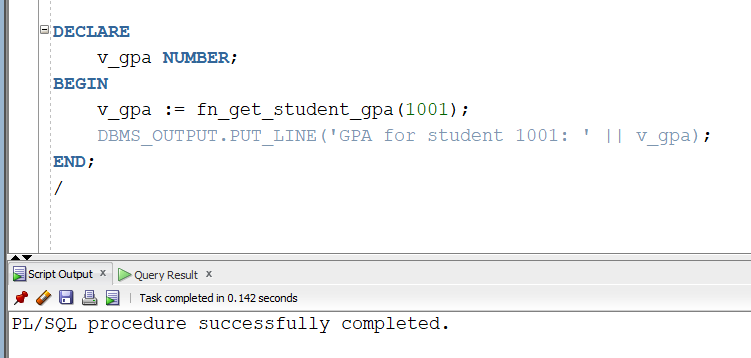
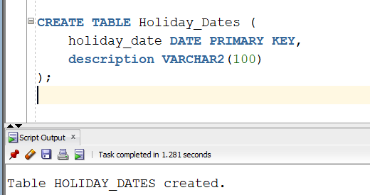
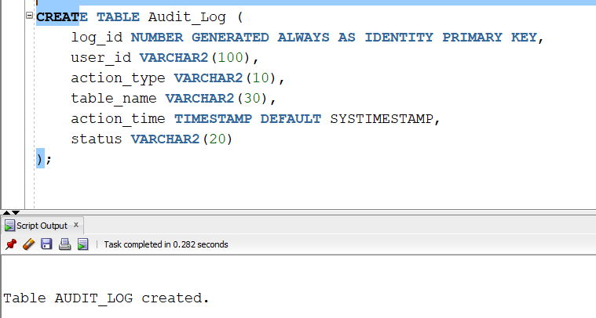
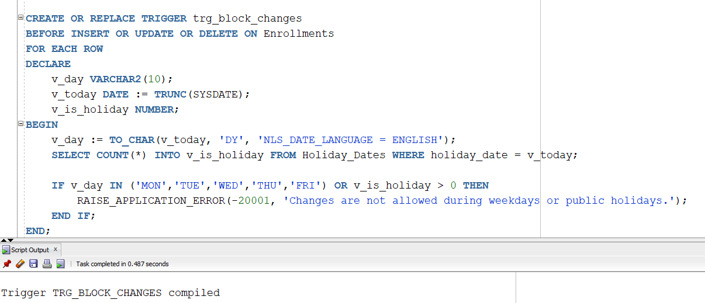
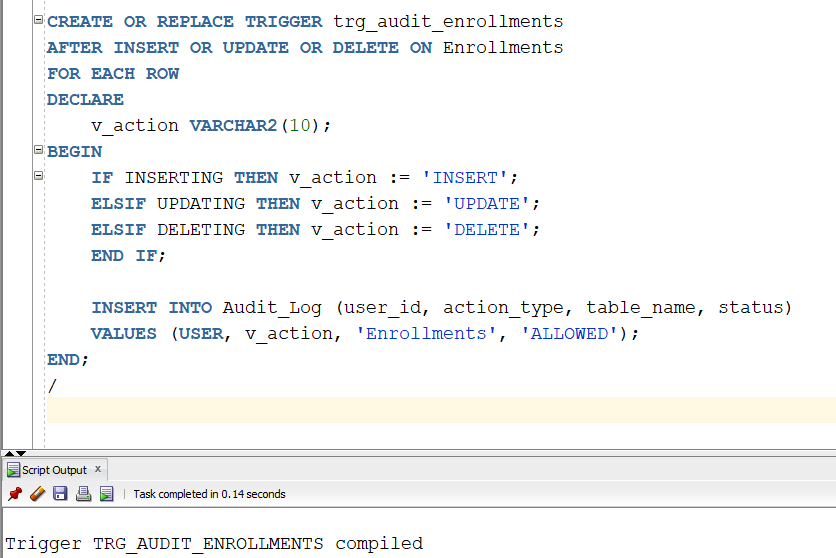

# 📘 University Course Management System – PL/SQL Capstone Project

## 👤 Student Info
- **Name:** Praise Mutijima
- **Student ID:** 25954
- **Course:** Database Development with PL/SQL (INSY 8311)
- **Lecturer:** Eric Maniraguha

---

## ✅ Phase I – Problem Statement & Presentation

### 📌 Problem Definition
Universities face challenges in managing course registrations, schedules, and grading. Manual operations lead to errors, inefficiencies, and limited access to academic records.

### 🏫 Context
This system will be used within a university to automate course registration, schedule assignment, and grade entry.

### 👥 Target Users
- Students
- Professors
- Administrators

### 🎯 Project Goals
- Automate registration and grade submission
- Prevent schedule conflicts
- Provide secure access to student records

### 📂 Main Entities
- Students
- Professors
- Courses
- Schedules
- Enrollments

### 📽️ Presentation
   [Click here to download the PowerPoint](./Wed_25954_praise_plsql.pptx)

---

## ✅ Phase II – Business Process Modeling (MIS)

### 📘 Overview
This phase models the flow of course registration, grade submission, and scheduling from the perspective of key actors: students, professors, administrators, and the system (MIS). It shows how the MIS supports and enhances decision-making and operational efficiency.

### 🧑‍🏫 Actors / Swimlanes
- **Student**: Registers for courses and views grades
- **Professor**: Manages course assignments and enters student grades
- **Administrator**: Schedules courses and assigns professors
- **System (MIS)**: Validates and stores all inputs, detects conflicts, and secures access

### 🧭 Process Modeled
1. Administrator creates the course schedule and assigns professors.
2. Student browses available courses and registers.
3. The system checks for conflicts and stores the enrollment.
4. At the end of the term, the professor submits grades.
5. The student views their grades through the system.

### 📊 Swimlane Diagram


### Model the Process
Steps to include in your diagram:
- Admin logs in and creates course schedule.
- Instructor is assigned to course.
- Student browses available courses.
- Student registers for selected courses.
- Instructor enters grades after course completion.
- Student views grades.
- MIS stores and updates data.

### Explanation of Business Process Model – University Course Management System

The modeled process demonstrates how students, professors, and administrators interact with a centralized MIS to manage academic operations. Students log in, view available courses, and register. The system checks for schedule conflicts before enrollment. Professors access assigned courses and submit student grades after course completion. The administrator manages course offerings and schedules, ensuring every course has an assigned professor and an available time slot.

The system enforces data integrity and access control. Students can only view their records, professors update only their assigned course grades, and admins handle course logistics. The MIS automates conflict detection and reduces errors, supporting fast, reliable decision-making.

This workflow increases efficiency, reduces administrative workload, and ensures accurate academic records. It directly supports MIS goals by streamlining operations, centralizing data, and improving data-driven decision-making.

  
### 🔍 Features of the Process Model
- Prevents scheduling conflicts using MIS logic
- Applies access control per user role (student/professor/admin)
- Centralizes grade storage and transcript access
- Encourages automation and traceability in the academic process

### 🧠 MIS Decision Support
- MIS checks time slots for overlap
- Records all actions for accountability
- Automatically restricts unauthorized actions (e.g., grade editing by students)


---

## ✅ Phase III – Logical Model Design - University Management System

### 📘 Overview
This phase defines the logical data model for the University Management System using the core primary entities based on the finalized ER diagram, which manages students, professors, courses, enrollments, and schedules.

### 🧱 Entity-Relationship (ER) Diagram


### 📂 Core Entities

#### Primary Entities
- **Students**: Contains student ID, name, department, email, and phone.
- **Professors**: Contains professor ID, name, department, email, and phone.
- **Courses**: Stores course ID, name, credits, department, and assigned professor ID.
- **Enrollments**: Join table to link students and courses, with enrollment ID, semester, and grade.
- **Schedules**: Associates a course with room, day, and timeslot.

### 🔗 Relationships (as per ER diagram)
- **Students → Enrollments**: One-to-Many (a student can enroll in many courses)
- **Courses → Enrollments**: One-to-Many (a course can have many enrolled students)
- **Professors → Courses**: One-to-Many (a professor can teach multiple courses)
- **Courses → Schedules**: One-to-One or One-to-Many (each course has a scheduled session)

### 🔐 Data Integrity Features
- **NOT NULL** constraints on all primary keys and essential fields
- **UNIQUE** constraints on identifiers such as email and course codes
- **CHECK** constraints (e.g., grade values, course credits, time slot formats)
- **Foreign Keys** to enforce referential integrity between students, courses, professors, and schedules

### 🔁 Normalization
The model is normalized to **3NF**:
- No repeating groups or partial dependencies
- All non-key attributes depend only on the primary key
- `Schedules` retains simplified structure (Room, TimeSlot, Day directly included)

### 💡 Key Design Decisions
1. **Simplified scheduling model**: room/time/day stored within Schedules without separating to avoid over-normalization.
2. **Join table Enrollments** handles many-to-many relationships between Students and Courses.
3. **Single professor assignment** per course ensures clear instructional responsibility.

---

## ✅ Phase IV – Database Creation and Naming

### 📛 Database Name
- **Database:** WED_25954_PRAISE_UNIVERSITY_DB
- **Password:** Praise
  
  

### 🔑 Privileges
- Granted **DBA** role to user



### 🖥️ OEM Access
- OEM accessed at `https://localhost:5500/`
- SSL bypass used to open OEM successfully

### 📸 Screenshots
- OEM login page – **SPACE FOR SCREENSHOT**
- Database dashboard – **SPACE FOR SCREENSHOT**
- Schema and tables visible – **SPACE FOR SCREENSHOT**
- Users and roles – **SPACE FOR SCREENSHOT**
- Performance metrics (optional) – **SPACE FOR SCREENSHOT**

---

## ✅ Phase V – Table Implementation and Data Insertion

### 🧱 Table Implementation
- Created tables: Students, Professors, Courses, Enrollments, Schedules
- Primary and foreign keys correctly defined
- Data types and integrity constraints enforced

### 📥 Sample Data Inserted
- Realistic records inserted into each table (3–5 entries per table)
- Test data supports queries and use cases

### 🔍 Data Integrity Verification
- Checked referential integrity and constraint enforcement
- Executed SELECT queries to verify insertions

### 📸 Screenshots
- Table creation confirmation – **SPACE FOR SCREENSHOT**
- Sample data inserted – **SPACE FOR SCREENSHOT**
- Query results and validation – **SPACE FOR SCREENSHOT**

---

## ✅ Phase VI – Database Interaction and Transactions

### 🔄 Operations Performed
Implemented DDL and DML operations for managing students, courses, enrollments, schedules, and professors.

- **DML**: `INSERT`, `UPDATE`, `DELETE` for Students, Courses, Enrollments
- **DDL**: Created PL/SQL procedures, functions, cursors, and packages

### 🧩 Procedures & Functions
- `proc_register_student`: A parameterized procedure to register a student for a course
- `fn_get_student_gpa`: A function that returns the GPA of a student based on all grades

### 🔁 Cursor Example
- Used cursor to loop through a student’s enrollments and display course IDs and grades

### 🧪 Exception Handling
- Implemented in procedures/functions to handle duplicate entries and missing data gracefully using `EXCEPTION WHEN ...`

### 📦 Package Implementation
- `student_pkg` package created to encapsulate:
  - `proc_register_student`
  - `fn_get_student_gpa`

### 🧪 Testing Summary
- Procedures and functions tested using anonymous PL/SQL blocks and `DBMS_OUTPUT`
- Cursor loops and error-handling behaviors verified for different test scenarios

### 📸 Screenshots
- Procedure creation and compilation –
  




- Function implementation and output –
  




- Cursor loop output in `DBMS_OUTPUT` – **SPACE FOR SCREENSHOT**
- Package body and execution – **SPACE FOR SCREENSHOT**
- Overall interaction result – **SPACE FOR SCREENSHOT**

---
## ✅ Phase VII – Advanced Database Programming and Auditing

### 🔒 Access Restrictions
Created mechanisms to prevent unauthorized DML (INSERT, UPDATE, DELETE) operations during weekdays and public holidays, and to monitor user actions.

### 📅 Holiday_Dates Table
```sql
CREATE TABLE Holiday_Dates (
    holiday_date DATE PRIMARY KEY,
    description VARCHAR2(100)
);
```
Stores official public holidays. Used to restrict changes on those days.

### 📋 Audit_Log Table
```sql
CREATE TABLE Audit_Log (
    log_id NUMBER GENERATED ALWAYS AS IDENTITY PRIMARY KEY,
    user_id VARCHAR2(100),
    action_type VARCHAR2(10),
    table_name VARCHAR2(30),
    action_time TIMESTAMP DEFAULT SYSTIMESTAMP,
    status VARCHAR2(20)
);
```
Captures user actions on the `Enrollments` table including action type, timestamp, and status.

### ⚠️ Trigger: Block Changes on Weekdays or Holidays
```sql
CREATE OR REPLACE TRIGGER trg_block_changes
BEFORE INSERT OR UPDATE OR DELETE ON Enrollments
FOR EACH ROW
DECLARE
    v_day VARCHAR2(10);
    v_today DATE := TRUNC(SYSDATE);
    v_is_holiday NUMBER;
BEGIN
    v_day := TO_CHAR(v_today, 'DY', 'NLS_DATE_LANGUAGE = ENGLISH');
    SELECT COUNT(*) INTO v_is_holiday FROM Holiday_Dates WHERE holiday_date = v_today;

    IF v_day IN ('MON','TUE','WED','THU','FRI') OR v_is_holiday > 0 THEN
        RAISE_APPLICATION_ERROR(-20001, 'Changes are not allowed during weekdays or public holidays.');
    END IF;
END;
/
```

### 🛡️ Trigger: Auditing Enrollments
```sql
CREATE OR REPLACE TRIGGER trg_audit_enrollments
AFTER INSERT OR UPDATE OR DELETE ON Enrollments
FOR EACH ROW
DECLARE
    v_action VARCHAR2(10);
BEGIN
    IF INSERTING THEN v_action := 'INSERT';
    ELSIF UPDATING THEN v_action := 'UPDATE';
    ELSIF DELETING THEN v_action := 'DELETE';
    END IF;

    INSERT INTO Audit_Log (user_id, action_type, table_name, status)
    VALUES (USER, v_action, 'Enrollments', 'ALLOWED');
END;
/
```

### 🧪 Testing
- Inserted holidays into `Holiday_Dates`
- Attempted DML actions on weekdays/holidays (triggered restriction)
- Successfully ran DML actions on weekend
- Verified actions logged in `Audit_Log`

### 📸 Screenshots
- `Holiday_Dates` and `Audit_Log` table creation




- `trg_block_changes` creation –


- `trg_audit_enrollments` creation –

- Error shown on restricted day – **SPACE FOR SCREENSHOT**
- Log entry after successful change – **SPACE FOR SCREENSHOT**
- Query output from `Audit_Log` – **SPACE FOR SCREENSHOT**


---

## 🔜 Next: Phase VIII – Documentation and Presentation
(Final GitHub Report & PowerPoint)
